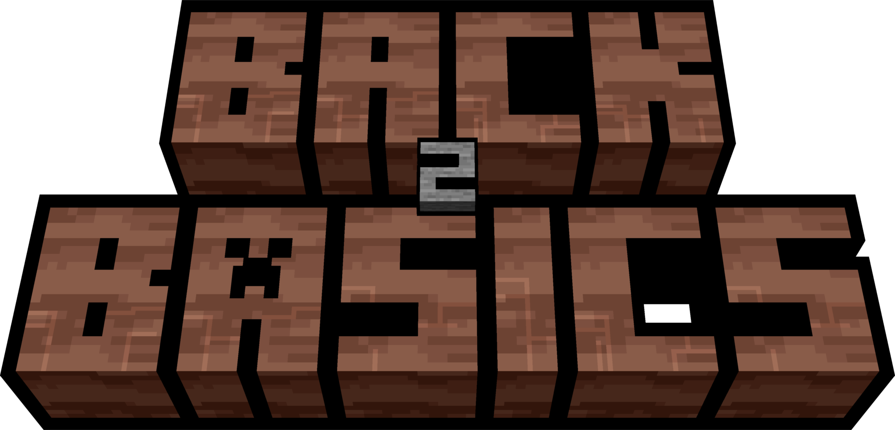

  

  <em><b>Back 2 Basics</b> is a project dedicated to replacing the default textures of Miniblox.</em>

---

## ⚠️ **Attention**

There are some known issues right now with color and some animations, these will be fixed with time.

---

## ⬇️ Downloads

You can install Back 2 Basics through an extension here, click which one you need:

Chrome - PENDING REVIEW

[Firefox](https://addons.mozilla.org/en-US/firefox/addon/back-2-basics/)

Edge - IN REVIEW

Opera - PENDING REVIEW

## ⭐ Star

If you want to say **Thank You** and/or support `Back 2 Basics`:

Add a [GitHub Star](https://github.com/heythereu/Miniblox-Textures/stargazers) to the project.

## 💡 Credits

If you encounter any issues with the textures, please let me know on discord:

@hunterd123 // Nickname: heythereu

Pack created by: heythereu

